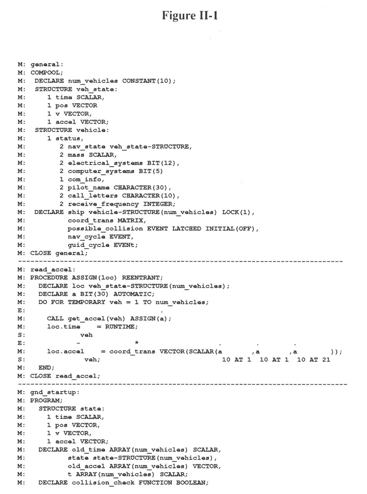
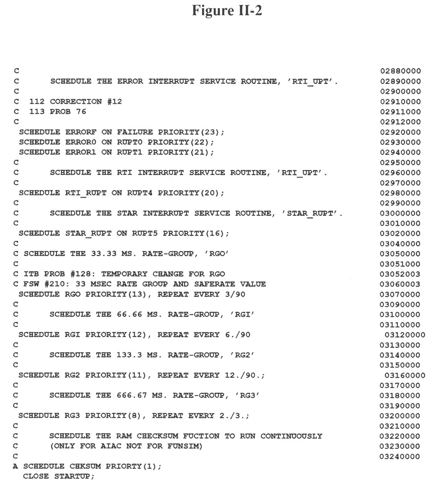

\newpageon{393}

# Appendix II: HAL/S, A\ Real-Time\ Language\ for\ Spaceflight {-}

HAL/S is a high-level programming language commissioned by NASA in the
late 1960s to meet the real-time programming needs of the Agency. At the
time, programs used on board spacecraft were either written in assembly
languages or in interpreted languages. The former make programs
difficult to write and maintain, and the latter are insufficiently
robust and slow. Also, future systems were expected to be much larger
and more complex, and cost would be moderated by the use of a high-level
language.

Since NASA directed the development of the language from the start, it
influenced the final form it took and specifically how it handled the
special needs of real-time processing. Statements common to other
high-level languages such as FORTRAN and PL/1 were put in HAL. These
included decision statements such as IF and looping statements such as
FOR, DO, and WHILE. NASA added to the list of statements several
specifically designed to create real-time processes, such as WAIT,
SCHEDULE, PRIORITY, and TERMINATE. The objective was to make HAL quickly
understandable to any programmer who had worked in other languages and
to give a variety of tools for developing the new real-time programs. To
make the language more readable by engineers, HAL lists source in such a
way as to retain traditional notation, with subscripts and superscripts
in their correct position, as contrasted with other languages, which
force such notation onto a single level (see Fig. II-I.)

In addition to new statements, HAL provided for new types of program
blocks. Two of these specific to real-time processing are COMPOOL and
TASK. "Compools" are declarations of data to be kept in a common data
area, thus making the data accessible to more than one process at a
time. It was expected that several processes would be active at once and
that many data items would need to he dynamically shared. Task blocks
are programs nested within larger programs that execute as real-time
processes dependent on one of the most powerful HAL statements,
SCHEDULE.

Scheduling the execution of specific tasks was simplified by the syntax
of HAL. Fig. II-2 shows the final page of the procedure STARTUP, written
for use on the Galileo spacecraft attitude control computers, containing
the master scheduling for the entire program. Note that the components
of the SCHEDULE statement are the task name, start time, priority, and
frequency. The statement "SCHEDULE ERROR0 ON RUPT0 PRIORITY(22);" tells
the operating system to execute the task ERROR0 when an interrupt named
RUPT0 occurs with a relative priority of 22. A different form of the SCHEDULE
\pagebreakon{394} statement is "SCHEDULE RG1 PRIORITY(12), REPEAT EVERY 6./90,"
which initiates the task handling the highest frequency rate group and
repeats it 15 times per second. The statement TERMINATE cancels a
specified task upon a designated interrupt or time.

HAL did not have the widespread use NASA had hoped for when the language
was designed. Although the Shuttle on-board programs are exclusively in
HAL, the Galileo attitude control system is the only other flight
project to make significant use of the language. Other projects, though
instructed to use HAL, found reasons to avoid it, although the Deep
Space Network applied it to some ground software. In late 1985, NASA
announced that the language of choice for the upcoming Space Station
project would be Ada. Commissioned by the Department of Defense in the
late 1970s to serve as a standard for all contractor software
development, Ada includes real-time constructs pioneered by HAL such as
task blocks, scheduling, and common data. The announcement made NASA the
first nonmilitary agency to use Ada. Ada was adopted because commercial
compilers were available and because the DoD's insistence on its use
meant that it would be around for a long time. It appears that HAL will
be phased out, destined to join the hundreds of other dead computer
languages.

More information on the HAL/S language is contained in the following
sources:

Intermetrics, Inc., *HAL/S-360 Compiler System Specification*,
Version IR-60-7, February 23, 1981.

Intermetrics, Inc., *HAL/S Language Specification*,
Version IR-542, September 1980.

Intermetrics, Inc., *HAL/S Programmer's Guide*,
Version IR-63-5, December 1981.

Ryer, Michael J., *Programming in HAL/S*, Intermetrics, Inc.,
Cambridge, MA, 1978.

\pagebreakon{395}

~~~ {caption="Figure II-1"}
M: general:
M: COMPOOL;
M:  DECLARE num_vehicles CONSTANT(10);
M:  STRUCTURE veh_state:
M:     1 time SCALAR,
M:     1 pos VECTOR,
M:     1 v VECTOR,
M:     1 accel VECTOR;
M:  STRUCTURE vehicle:
M:     1 status,
M:        2 nav_state veh_state-STRUCTURE,
M:        2 mass SCALAR,
M:        2 electrical_systems BIT(12),
M:        2 computer_systems BIT(5),
M:        1 com_info,
M:        2 pilot_name CHARACTER(30),
M:        2 call_letters CHARACTER(10),
M:        2 receive_frequency INTEGER;
M:  DECLARE ship vehicle-STRUCTURE(num_vehicles) LOCK(1),
M:          coord_trans MATRIX,
M:          possible_collision EVENT LATCHED INITIAL(OFF),
M:          nav_cycle EVENT,
M:          guid_cycle EVENT;
M: CLOSE general;
-------------------------------------------------------------------------------
M: read_accel:
M: PROCEDURE ASSIGN(loc) REENTRANT;
M:   DECLARE loc veh_state-STRUCTURE(num_vehicles);
M:   DECLARE a BIT(30) AUTOMATIC;
M:   DO FOR TEMPORARY veh = 1 TO num_vehicles;
E:                                .
M:     CALL get_accel(veh) ASSIGN(a);
M:     loc.time    = RUNTIME;
S:             veh
E:            -             *                   .        .        .
M:     loc.accel    = coord_trans VECTOR(SCALAR(a       ,a       ,a        ));
S:              veh;                             10 AT 1  10 AT 1  10 AT 21
M:   END;
M: CLOSE read_accel;
-------------------------------------------------------------------------------
M: gnd_startup:
M: PROGRAM;
M:   STRUCTURE state:
M:     1 time SCALAR,
M:     1 pos VECTOR,
M:     1 v VECTOR,
M:     1 accel VECTOR;
M:   DECLARE old_time ARRAY(num_vehicles) SCALAR,
M:          state state-STRUCTURE(num_vehicles),
M:          old_accel ARRAY(num_vehicles) VECTOR,
M:          t ARRAY (num_vehicles) SCALAR;
M:   DECLARE collision_check FUNCTION BOOLEAN;
~~~

<!--

-->

\pagebreakon{396}

~~~ {caption="Figure II-1 (Continued)"}
M:   CALL Kalman;
M:   CALL new_state;
E:
M:   IF collision_check THEN
M:     DO;
C:            inform all interested processes of collision threat.
M:       SET possible_collision;
M:       SCHEDULE fast_nav IN 2 PRIORITY(35),
M:            REPEAT EVERY 2 UNTIL 10 FLOOR(RUNTIME / 10) + 9;
M:     END;
M:   ELSE
M:     RESET possible_collision;

M: fast_nav:
M: TASK;               /*perform a fast intermediate update of the state vectors*/
M:   [t] = {time} - [old_time];
E:                             +
M:   CALL read_accel ASSIGN({state});
C:           Update the entire array of position vectors and velocity vectors.
E:     -       -      -                -          -          2
M:   {pos} = {pos} + {v} [t] + .25 ({accel} +[old_accel]) [t] ;
E:    -     -           -           -
M:   {v} = {v} + .5 ({accel} + [old_accel]) [t];
M:   CALL new_state;
M: CLOSE fast_nav;

M: new_state:
M: PROCEDURE;                   /*internal procedure to update the state vectors*/
M:   [old_time] = {time};
E:        -           -
M:   [old_accel] = {accel};

M: UPDATE;         /*use update block to access shared data in controlled manner*/
E:                    +           +
M:   {ship.status.nav_state} = {state};
M: CLOSE;

M: collision_check:
M: FUNCTION BOOLEAN;       /*check if any pair of vehicles is too close together*/
M:   DECLARE too_close SCALAR INITIAL(5000);
M:   DO FOR TEMPORARY veh = 1 TO num_vehicles;
M:      DO FOR TEMPORARY other = veh = 1 TO num_vehicles;
E:                    -         -
M:         IF ABVAL (pos     - pos      ) < too_close THEN
S:                      veh;      other;
M:            RETURN TRUE;
M:      END;
M:   END;
M:   RETURN FALSE;
M: CLOSE collision_check;

M: Kalman:
M: PROCEDURE;            /*perform a sophisticated but slow navigation algorithm*/
C:      .
C:      .
C:      .
M: CLOSE Kalman;

M: CLOSE nav;
~~~

<!--

-->

\pagebreakon{397}

~~~ {caption="Figure II-2"}
C                                                                      02880000
C      SCHEDULE THE ERROR INTERRUPT SERVICE ROUTINE, ’RTI_UPT’.        02890000
C                                                                      02900000
C  112 CORRECTION #12                                                  02910000
C  113 PROB 76                                                         02911000
C                                                                      02912000
 SCHEDULE ERRORF ON FAILURE PRIORITY(23);                              02920000
 SCHEDULE ERROR0 ON RUPT0 PRIORITY(22);                                02930000
 SCHEDULE ERROR1 ON RUPT1 PRIORITY(21);                                02940000
C                                                                      02950000
C      SCHEDULE THE RTI INTERRUPT SERVICE ROUTINE, ’RTI_UPT’.          02960000
C                                                                      02970000
 SCHEDULE RTI_RUPT ON RUPT4 PRIORITY(20);                              02980000
C                                                                      02990000
C      SCHEDULE THE STAR INTERRUPT SERVICE ROUTINE, ‘STAR_RUPT’.       03000000
C                                                                      03010000
 SCHEDULE STAR_RUPT ON RUPT5 PRIORITY(16);                             03020000
C                                                                      03040000
C SCHEDULE THE 33.33 MS. RATE-GROUP, ’RGO’                             03050000
C                                                                      03051000
C ITB PROB #128: TEMPORARY CHANGE FOR RGO                              03052003
C FSW #210: 33 MSEC RATE GROUP AND SAFERATE VALUE                      03060003
 SCHEDULE RGO PRIORITY(13), REPEAT EVERY 3/90                          03070000
C                                                                      03090000
C      SCHEDULE THE 66.66 MS. RATE-GROUP, ’RGI’                        03100000
C                                                                      03110000
 SCHEDULE RGI PRIORITY(12), REPEAT EVERY 6./90                         03120000
C                                                                      03130000
C      SCHEDULE THE 133.3 MS. RATE-GROUP, ’RG2’                        03140000
C                                                                      03150000
 SCHEDULE RG2 PRIORITY(11), REPEAT EVERY 12./90.;                      03160000
C                                                                      03170000
C      SCHEDULE THE 666.67 MS. RATE-GROUP, ’RG3’                       03180000
C                                                                      03190000
 SCHEDULE RG3 PRIORITY(8), REPEAT EVERY 2./3.;                         03200000
C                                                                      03210000
C      SCHEDULE THE RAM CHECKSUM FUCTION TO RUN CONTINUOUSLY           03220000
C      (ONLY FOR AIAC NOT FOR FUNSIM)                                  03230000
C                                                                      03240000
A SCHEDULE CHKSUM PRIORITY(1);
  CLOSE STARTUP;
~~~

<!--

-->
