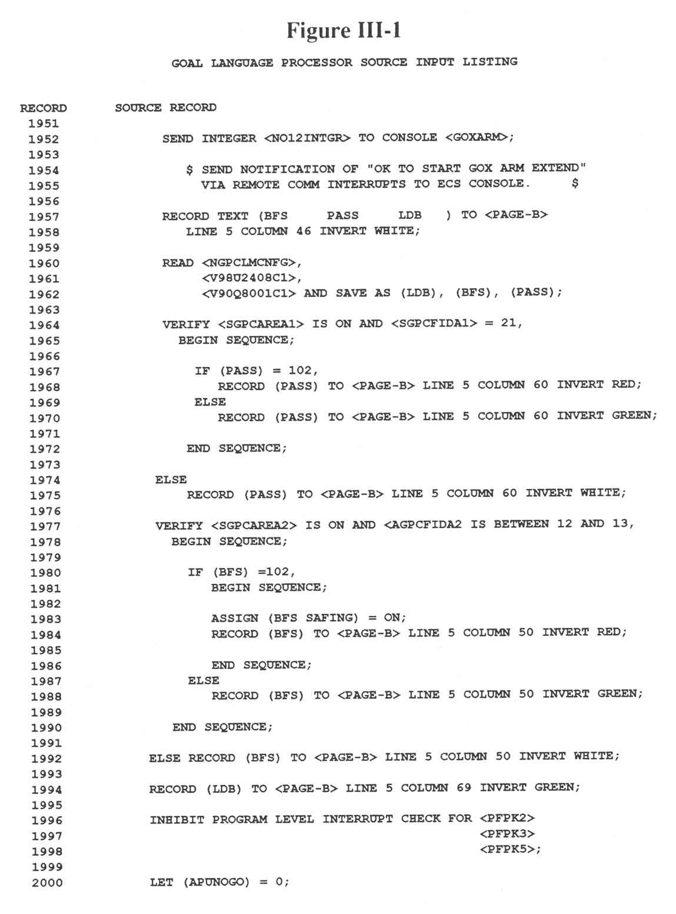

\newpageon{399}

# Appendix III: GOAL, A\ Language\ for\ Launch\ Processing {-}

GOAL is a high-level language that uses the terminology of test
engineers to write tests and procedures to certify that a Shuttle
vehicle is ready for launch. When the first automated preflight checkout
programs were written in the mid-1960s, Marshall Space Flight Center
originated ATOLL, a special high-level language for use in preparing
test procedures. GOAL superseded that language in the early 1970s.

Fig. III-1 is a segment of a GOAL program used to safe various
spacecraft systems if a NOGO condition causes the final countdown to be
suspended. Note that names of data items held in common in the Launch
Processing System appear within brackets, <>, and data local to
the program is named between parentheses, (). Statements familiar to
high-level programming language users, such as READ, IF-THEN-ELSE, and
LET, have similar functions in GOAL. Additional statements, such as
VERIFY, make it possible for the engineers to test whether valves or
switches are set properly or whether a value is within a specified
range. SET permits switches to be activated.

Although seemingly highly structured, GOAL allows engineers to
frequently repeat the most common error of their peers using FORTRAN:
excessive unconditional jumps such as the one on line 2030, making it
difficult for someone to read and modify the program. Whereas in older
versions of FORTRAN it was necessary to create structures such as those
found between lines 2026 and 2039 to handle multiple statements in the
THEN and ELSE blocks of a selection structure, later versions of the
language and GOAL itself (see lines 1980 through 1988) permit multiple
lines of code to be included within the blocks. Therefore, the GOTO
statements are often used less to create structure than to provide a
"quick fix" when the logic of the program needs expanding.

GOAL is used both at the Kennedy Space Center and Vandenberg Air Force
Base in launch processing systems and is expected to last for the
duration of the Shuttle program.

Further information about GOAL is contained in the following documents:

IBM Corporation, *Launch Processing System Checkout, Control and
Monitor Subsystem Detailed Software Design Specifications, Book 2, Part
1: GOAL Language Processor*, KSC-LPS-IB-070-2, pt. 1, release S33, Cape
Canaveral, FL, June 3, 1983.

IBM Corporation, *Launch Processing System Checkout, Control, and
Monitor Subsystem*: GOAL On-Board Interface Language, KSC-LPS-OP-033-4,
release S33, Cape Canaveral, FL, April 27, 1983.

\pagebreakon{400}

\pagebreakon{401}

