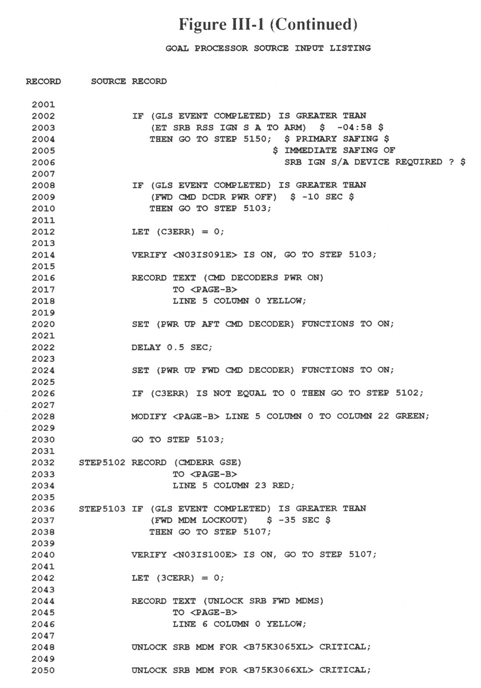

\newpageon{399}

# Appendix III: GOAL, A\ Language\ for\ Launch\ Processing {-}

GOAL is a high-level language that uses the terminology of test
engineers to write tests and procedures to certify that a Shuttle
vehicle is ready for launch. When the first automated preflight checkout
programs were written in the mid-1960s, Marshall Space Flight Center
originated ATOLL, a special high-level language for use in preparing
test procedures. GOAL superseded that language in the early 1970s.

Fig. III-1 is a segment of a GOAL program used to safe various
spacecraft systems if a NOGO condition causes the final countdown to be
suspended. Note that names of data items held in common in the Launch
Processing System appear within brackets, <>, and data local to
the program is named between parentheses, (). Statements familiar to
high-level programming language users, such as READ, IF-THEN-ELSE, and
LET, have similar functions in GOAL. Additional statements, such as
VERIFY, make it possible for the engineers to test whether valves or
switches are set properly or whether a value is within a specified
range. SET permits switches to be activated.

Although seemingly highly structured, GOAL allows engineers to
frequently repeat the most common error of their peers using FORTRAN:
excessive unconditional jumps such as the one on line 2030, making it
difficult for someone to read and modify the program. Whereas in older
versions of FORTRAN it was necessary to create structures such as those
found between lines 2026 and 2039 to handle multiple statements in the
THEN and ELSE blocks of a selection structure, later versions of the
language and GOAL itself (see lines 1980 through 1988) permit multiple
lines of code to be included within the blocks. Therefore, the GOTO
statements are often used less to create structure than to provide a
"quick fix" when the logic of the program needs expanding.

GOAL is used both at the Kennedy Space Center and Vandenberg Air Force
Base in launch processing systems and is expected to last for the
duration of the Shuttle program.

Further information about GOAL is contained in the following documents:

IBM Corporation, *Launch Processing System Checkout, Control and
Monitor Subsystem Detailed Software Design Specifications, Book 2, Part
1: GOAL Language Processor*, KSC-LPS-IB-070-2, pt. 1, release S33, Cape
Canaveral, FL, June 3, 1983.

IBM Corporation, *Launch Processing System Checkout, Control, and
Monitor Subsystem*: GOAL On-Board Interface Language, KSC-LPS-OP-033-4,
release S33, Cape Canaveral, FL, April 27, 1983.

\pagebreakon{400}

~~~ {caption="Figure III-1"}
                   GOAL LANGUAGE PROCESSOR SOURCE INPUT LISTING

RECORD      SOURCE RECORD
 1951
 1952             SEND INTEGER <NO12INTGR> TO CONSOLE <GOXARM>;
 1953
 1954                $ SEND NOTIFICATION OF "OK TO START GOX ARM EXTEND"
 1955                  VIA REMOTE COMM INTERRUPTS TO ECS CONSOLE.     $
 1956
 1957             RECORD TEXT (BFS     PASS     LDB   ) TO <PAGE-B>
 1958                LINE 5 COLUMN 46 INVERT WHITE;
 1959
 1960             READ <NGPCLMCNFG>,
 1961                  <V98U2408C1>,
 1962                  <V90Q8001C1> AND SAVE AS (LDB), (BFS), (PASS);
 1963
 1964             VERIFY <SGPCAREA1> IS ON AND <SGPCFIDA1> = 21,
 1965               BEGIN SEQUENCE;
 1966
 1967                 IF (PASS) = 102,
 1968                    RECORD (PASS) TO <PAGE-B> LINE 5 COLUMN 60 INVERT RED;
 1969                 ELSE
 1970                    RECORD (PASS) TO <PAGE-B> LINE 5 COLUMN 60 INVERT GREEN;
 1971
 1972                END SEQUENCE;
 1973
 1974            ELSE
 1975                RECORD (PASS) TO <PAGE-B> LINE 5 COLUMN 60 INVERT WHITE;
 1976
 1977            VERIFY <SGPCAREA2> IS ON AND <AGPCFIDA2> IS BETWEEN 12 AND 13,
 1978              BEGIN SEQUENCE;
 1979
 1980                IF (BFS) =102,
 1981                   BEGIN SEQUENCE;
 1982
 1983                   ASSIGN (BFS SAFING) = ON;
 1984                   RECORD (BFS) TO <PAGE-B> LINE 5 COLUMN 50 INVERT RED;
 1985
 1986                   END SEQUENCE;
 1987                ELSE
 1988                   RECORD (BFS) TO <PAGE-B> LINE 5 COLUMN 50 INVERT GREEN;
 1989
 1990              END SEQUENCE;
 1991
 1992           ELSE RECORD (BFS) TO <PAGE-B> LINE 5 COLUMN 50 INVERT WHITE;
 1993
 1994           RECORD (LDB) TO <PAGE-B> LINE 5 COLUMN 69 INVERT GREEN;
 1995
 1996           INHIBIT PROGRAM LEVEL INTERRUPT CHECK FOR <PFPK2>
 1997                                                     <PFPK3>
 1998                                                     <PFPK5>;
 1999
 2000           LET (APUNOGO) = 0;
~~~

<!--

-->

\pagebreakon{401}

~~~ {caption="Figure III-1 (Continued)"}
                        GOAL PROCESSOR SOURCE INPUT LISTING

RECORD     SOURCE RECORD
 2001
 2002             IF (GLS EVENT COMPLETED) IS GREATER THAN
 2003                (ET SRB RSS IGN S A TO ARM)  $  -04:58 $
 2004                THEN GO TO STEP 5150;  $ PRIMARY SAFING $
 2005                                     $ IMMEDIATE SAFING OF
 2006                                       SRB IGN S/A DEVICE REQUIRED ? $
 2007
 2008             IF (GLS EVENT COMPLETED) IS GREATER THAN
 2009                (FWD CMD DCDR PWR OFF)  $ -10 SEC $
 2010                THEN GO TO STEP 5103;
 2011
 2012             LET (C3ERR) = 0;
 2013
 2014             VERIFY <N03IS091E> IS ON, GO TO STEP 5103;
 2015
 2016             RECORD TEXT (CMD DECODERS PWR ON)
 2017                    TO <PAGE-B>
 2018                    LINE 5 COLUMN 0 YELLOW;
 2019
 2020             SET (PWR UP AFT CMD DECODER) FUNCTIONS TO ON;
 2021
 2022             DELAY 0.5 SEC;
 2023
 2024             SET (PWR UP FWD CMD DECODER) FUNCTIONS TO ON;
 2025
 2026             IF (C3ERR) IS NOT EQUAL TO 0 THEN GO TO STEP 5102;
 2027
 2028             MODIFY <PAGE-B> LINE 5 COLUMN 0 TO COLUMN 22 GREEN;
 2029
 2030             GO TO STEP 5103;
 2031
 2032    STEP5102 RECORD (CMDERR GSE)
 2033                    TO <PAGE-B>
 2034                    LINE 5 COLUMN 23 RED;
 2035
 2036    STEP5103 IF (GLS EVENT COMPLETED) IS GREATER THAN
 2037                (FWD MDM LOCKOUT)   $ -35 SEC $
 2038                THEN GO TO STEP 5107;
 2039
 2040             VERIFY <N03IS100E> IS ON, GO TO STEP 5107;
 2041
 2042             LET (3CERR) = 0;
 2043
 2044             RECORD TEXT (UNLOCK SRB FWD MDMS)
 2045                    TO <PAGE-B>
 2046                    LINE 6 COLUMN 0 YELLOW;
 2047
 2048             UNLOCK SRB MDM FOR <B75K3065XL> CRITICAL;
 2049
 2050             UNLOCK SRB MDM FOR <B75K3066XL> CRITICAL;
~~~

<!--

-->
