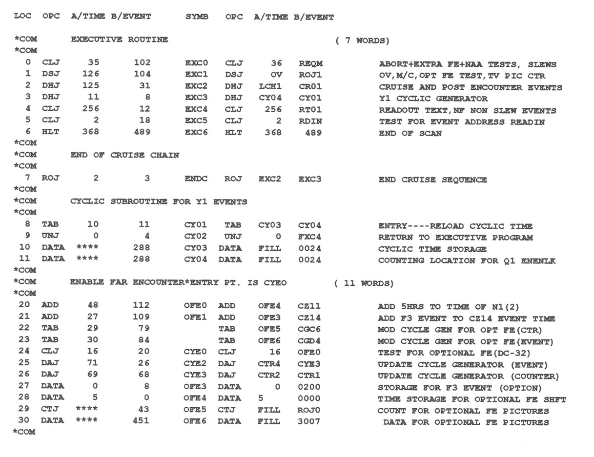

\newpageon{404}

# Appendix IV: Mariner Mars 1969 Flight Program {-}

This segment of a Mariner programmable sequencer flight program is given
as an example of the sort of flexibility gained by adding a memory to
the system. The first segment, the Executive, is only seven lines, yet
it essentially controlled the software. The remaining code demonstrates
a typical subroutine. The entire length of this program was 128 lines.
